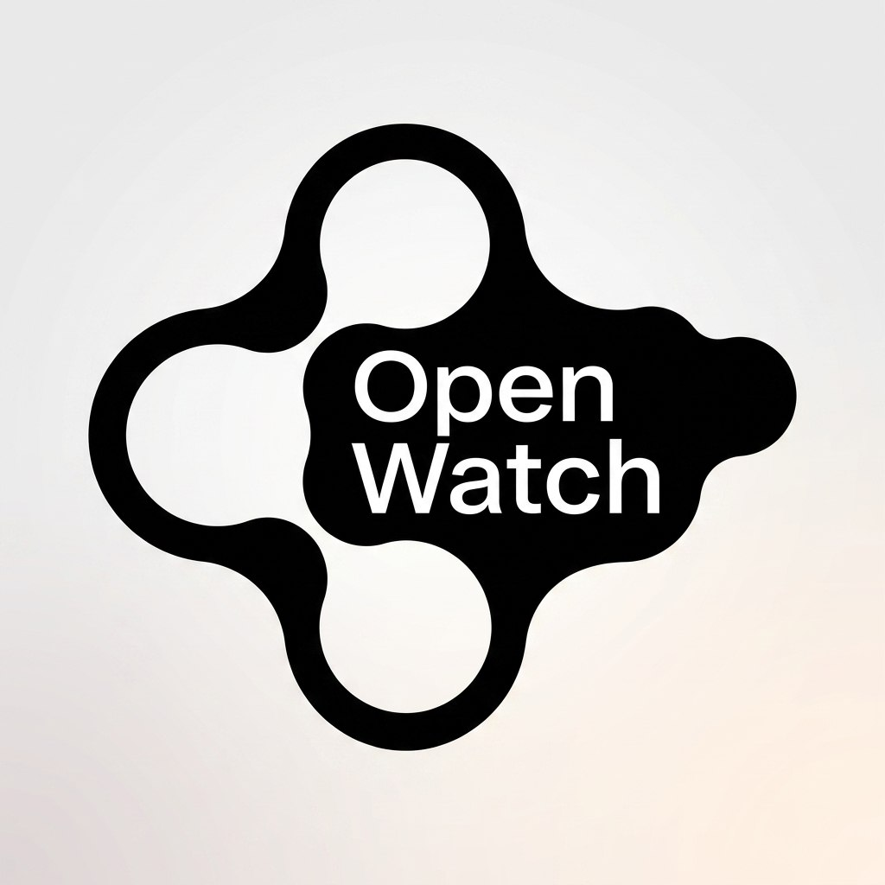
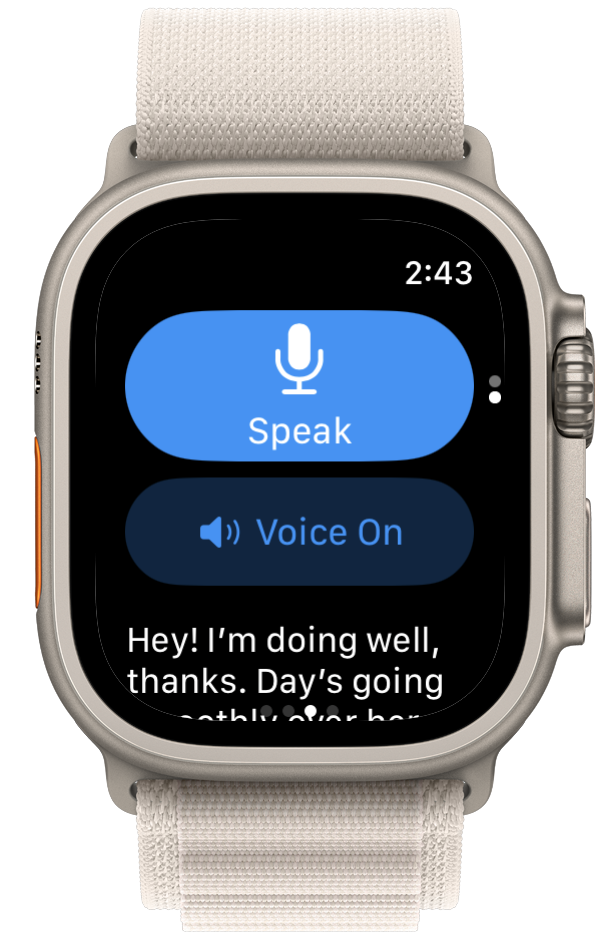
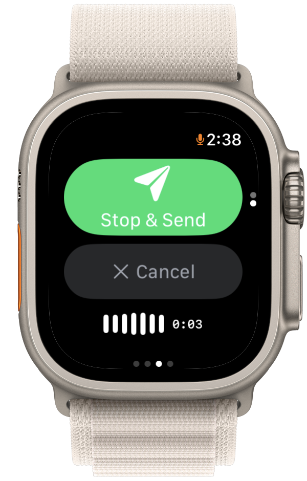
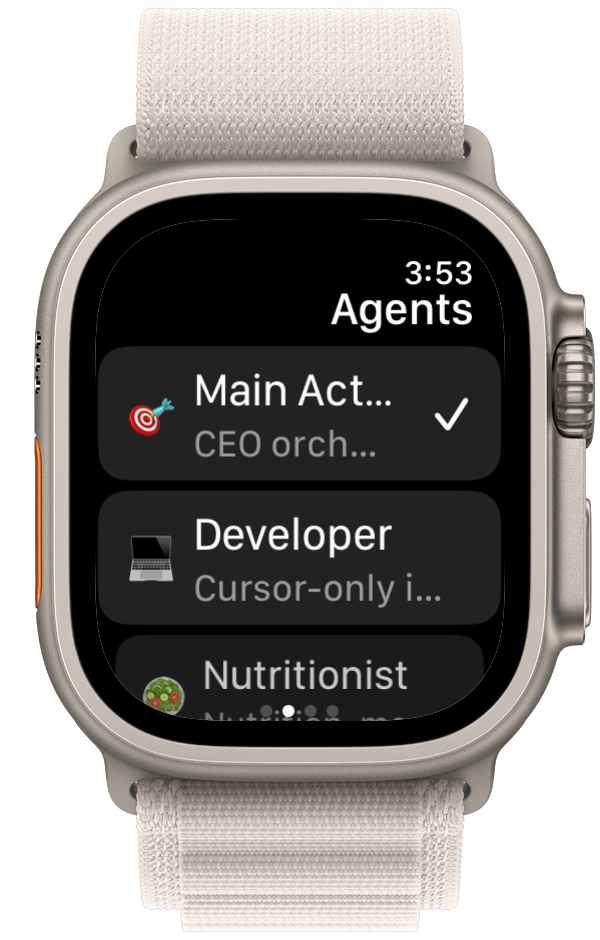
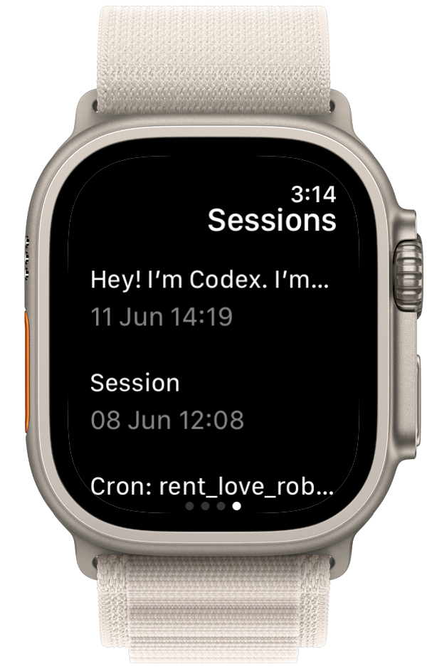
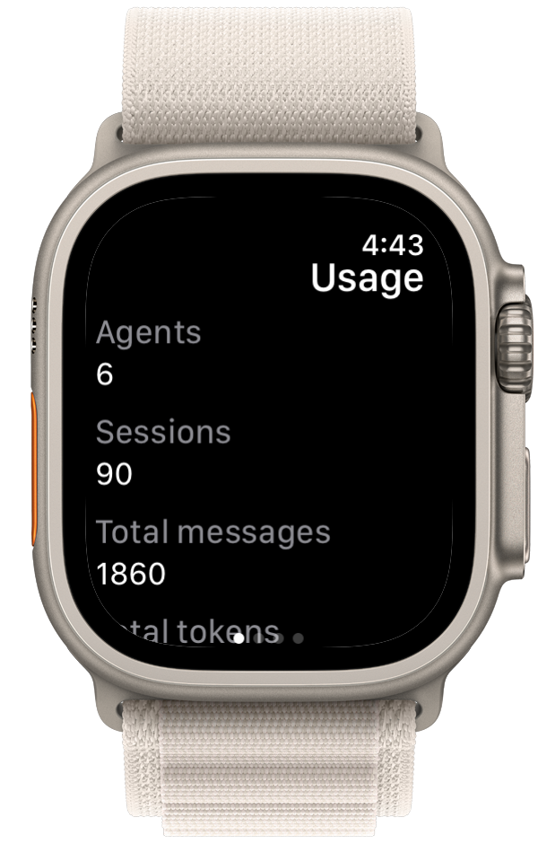
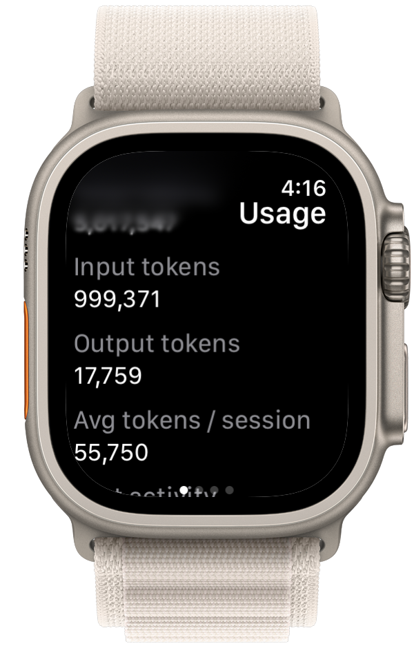
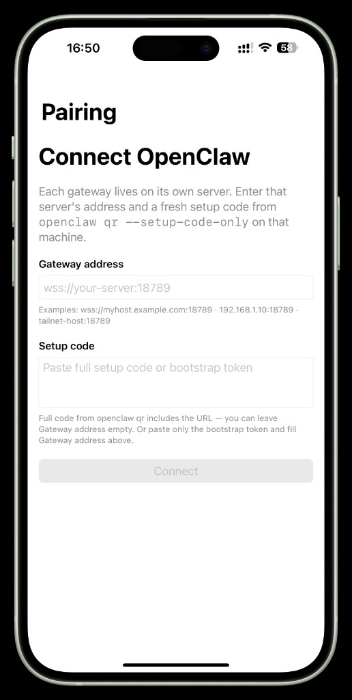
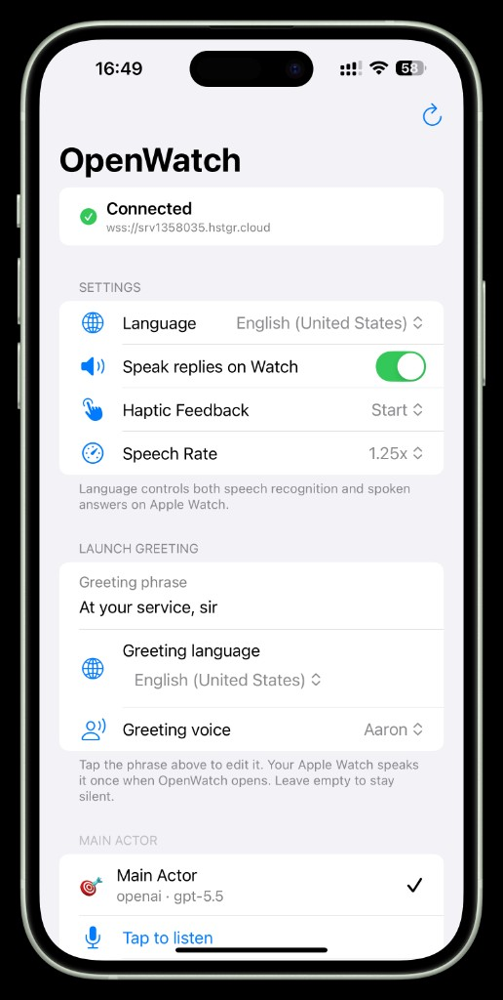

<p align="center">
  
</p>

# Open Watch Agent

Open Watch Agent is an AI wrist-first interface. It lets you manage your AI agents from your wrist. If you want your AI assistant to feel always available, this is it. Anyone with a watch that has internet can access their own AI agents.

This is fully open-source

<p>
  
  
  
</p>

<p>
  
  
  
</p>

## Why

Most AI-agent workflows still assume that you are sitting at a computer or holding a phone. Your AI agent can be closer to you. This feel is not native. Open Watch Agent works while you're cycling or in a sauna.

Raise your wrist -> speak -> send -> get shit done. Working with AirPods & Apple Watch

## Supported Platforms

- [x] Apple Watch (watchOS 10+)
- [x] iPhone (iOS 18+)
- [ ] Android
- [ ] Samsung Galaxy Watch
- [ ] Google Pixel Watch
- [ ] OnePlus Watch 2
- [ ] Other Wear OS watches with Network

Agent backends:

- [x] OpenClaw
- [ ] Nanoclaw
- [ ] Hermes
- [ ] Other agent with gateway

## OpenClaw Pairing Example

```text
Gateway address:
wss://openclaw.example.com:18789

Setup code:
<the full output from openclaw qr --setup-code-only>
```

<p>
  
  
</p>

## Run on iPhone & Watch

This project is not published in the App Store yet. If you want to test it, you can run it locally through Xcode on your iPhone and Apple Watch.

## Contributing

We want the community to help grow Open Watch Agent in these directions:

- New watch and phone platforms (Android, Wear OS, and more)
- New agent backends (Nanoclaw, Hermes, and other gateways)
- Better wrist-first voice UX
- Bug fixes, docs, and real-device testing

## How to contribute:

1. For bugs and ideas, open a GitHub issue first: [github.com/alxgntv/OpenWatchAgent/issues](https://github.com/alxgntv/OpenWatchAgent/issues)
2. For bigger changes, discuss the idea in an issue before coding.
3. Fork the repo, create a focused branch, and open a pull request.
4. Keep PRs small and scoped to one change.
5. Test on a real iPhone and Apple Watch when your change touches app behavior.

Code review rules:

- Every PR gets reviewed before merge.
- Be ready to update your PR based on review feedback.
- Do not open huge refactors without an approved issue.
- Do not change unrelated files in the same PR.
- Prefer native Apple APIs and existing project patterns.

## Support

Need help or found a bug? Create a GitHub issue: [github.com/alxgntv/OpenWatchAgent/issues](https://github.com/alxgntv/OpenWatchAgent/issues)
