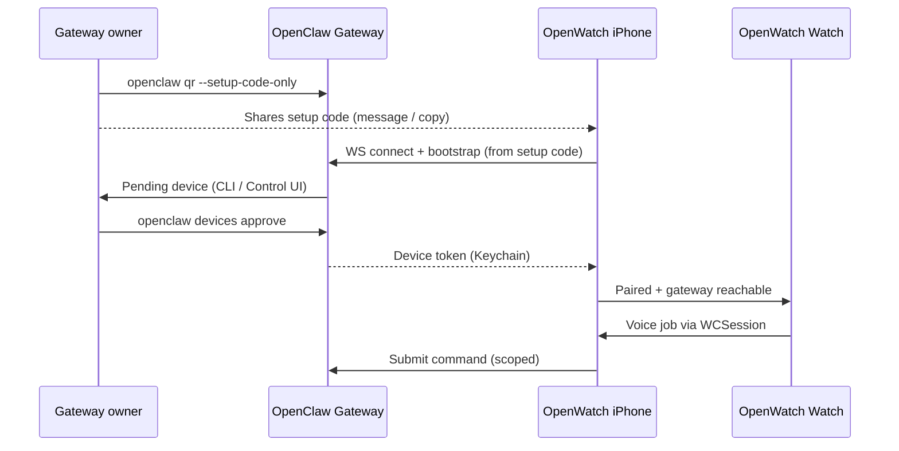

# OpenWatch — Pairing (Native OpenClaw)

**Decision (fixed):** OpenWatch uses **Native OpenClaw pairing** only for v1.  
**Ingress (fixed):** user enters the OpenClaw **setup code** from `openclaw qr` (not QR scan in v1).  
No manual Gateway master token paste for mass-market onboarding (advanced settings may allow URL override later).

---

## What this means

| OpenWatch | OpenClaw |
|-----------|----------|
| iOS / watchOS app | User’s **Gateway** (self-hosted or future managed cloud) |
| Voice jobs | Agent run on Gateway (default `main`) |
| Pairing | Official **device pairing** via **setup code** from `openclaw qr` |

Reference docs:

- [Gateway pairing](https://docs.openclaw.ai/gateway/pairing)
- [`openclaw qr`](https://docs.openclaw.ai/cli/qr)
- [`openclaw devices`](https://docs.openclaw.ai/cli/devices)
- [Gateway protocol](https://docs.openclaw.ai/gateway/protocol) (WebSocket)

---

## User journey (self-hosted)



### Steps

1. **Prerequisite** — User already runs OpenClaw Gateway (Docker, Mac, VPS, etc.).
2. **Owner** on Gateway machine:
   ```bash
   openclaw qr --setup-code-only
   ```
   Copy the **setup code** and send it to the phone (iMessage, Telegram, email, etc.).  
   Optional for owner debugging: `openclaw qr` (prints QR + code); OpenWatch v1 does **not** scan QR.
3. **OpenWatch iPhone** — Onboarding:
   - **Enter setup code** (single text field; normalize trim / case per OpenClaw rules).
   - App resolves bootstrap payload and opens Gateway **WebSocket**.
4. App opens **WebSocket** to Gateway URL from payload (`wss://` or trusted LAN / Tailscale).
5. Gateway creates **pending device pairing** → owner approves:
   ```bash
   openclaw devices list
   openclaw devices approve <requestId>
   ```
6. App stores **device token** in **Keychain** (never UserDefaults).
7. User picks default **agent id** (default `main`) if we expose `agents_list`.
8. **Test job** — tap listen → tap send → verify loader → job screen.

---

## Setup code (v1 — do not invent a custom format)

OpenWatch accepts the **opaque setup code** emitted by OpenClaw (`openclaw qr` / `openclaw qr --setup-code-only`).  
The app must **not** define its own pairing string format; decode/bootstrap exactly as the OpenClaw mobile node flow expects.

Resolved from setup code (via Gateway bootstrap, not guessed client-side):

- Gateway WebSocket URL (`wss://` or trusted LAN / Tailscale)
- Short-lived **bootstrap token** (not the long-lived shared `OPENCLAW_GATEWAY_TOKEN`)
- Auth mode hints needed for `connect`

CLI notes (from OpenClaw docs):

- Owner command: `openclaw qr --setup-code-only` (preferred for Watch users).
- `--token` / `--password` on `openclaw qr` are owner-side overrides only; never type those into OpenWatch.
- Mobile pairing **fails closed** on public `ws://`; remote users need **Tailscale Serve/Funnel** or **`wss://`**.
- After submit, device stays **pending** until `devices approve`.

### v1 non-goal

- **QR scan** in OpenWatch (may add in v1.1; same payload as setup code).

---

## Transport after pairing

**Primary (v1 target):** Gateway **WebSocket** after successful `connect` + device token.

Use for:

- Connection health
- Job lifecycle events (loader updates) if exposed by protocol / tasks API
- Future: talk/session APIs if needed for streaming STT

**Job submission** (implementation detail, pick one during build):

| Option | Pros | Cons |
|--------|------|------|
| WS RPC + agent run | Native, events | More client code |
| HTTP hook `POST /hooks/openwatch` | Simple body | Requires separate hook token OR server plugin; **not** default for mass pairing |
| `POST /v1/responses` + SSE | Rich streaming | Broader operator scope; careful scoping |

**Pairing doc default:** implement WS client consistent with OpenClaw mobile node bootstrap; add HTTP hook only as dev shortcut behind “Advanced”.

---

## Scopes and trust

Mobile bootstrap typically receives:

- Primary **node** token with minimal scopes
- Bounded **operator handoff** for onboarding (`operator.read`, `operator.write`, etc.)

OpenWatch must **not** require `operator.admin` or `operator.pairing` on the phone for normal voice jobs.

**Approve** is always done by the **Gateway owner** on a trusted device (CLI, Control UI, or future in-app approve on desktop).

### Revoke

- Owner: `openclaw devices remove <deviceId>`
- App: “Disconnect” clears Keychain and returns to onboarding.

---

## iPhone onboarding screens

| Step | Screen |
|------|--------|
| 1 | Welcome — “Connect your OpenClaw agent” |
| 2 | Explain prerequisite + link to OpenClaw install docs |
| 3 | **Enter setup code** (primary screen) |
| 4 | Waiting for approval (poll `devices` or show instructions) |
| 5 | Connected — agent picker (default `main`) |
| 6 | Optional: Test voice job |

**Advanced (hidden):** manual Gateway URL for debugging only.

---

## Watch ↔ iPhone after pairing

- Watch **never** holds Gateway tokens in v1.
- iPhone is the only component that talks to Gateway.
- `WCSession` messages: `jobState`, `jobResult`, `startListening`, `stopAndSend`.

---

## Gateway owner checklist (for docs / support)

```bash
# 1. Ensure gateway reachable (prefer wss or Tailscale)
openclaw gateway status

# 2. Generate setup code for OpenWatch
openclaw qr --setup-code-only

# 3. After user enters code in OpenWatch
openclaw devices list
openclaw devices approve <requestId>

# 4. Revoke lost phone
openclaw devices remove <deviceId>
```

---

## Explicit non-goals (pairing v1)

- OpenWatch Cloud / hosted Gateway account (future product mode).
- Pasting `OPENCLAW_GATEWAY_TOKEN` as the default onboarding path.
- Channel pairing codes (`openclaw pairing approve telegram`) — those are for **Telegram/WhatsApp senders**, not for OpenWatch device auth.

---

## Implementation checklist (OpenWatch repo)

- [ ] `GatewayPairingClient` — redeem setup code, WS connect, bootstrap
- [ ] `SetupCodeEntryView` — single-field entry + validation errors (English UI)
- [ ] `KeychainStore` — device token + gateway URL
- [ ] `PairingViewModel` — states: idle → submitting code → pending approval → connected
- [ ] `JobService` — submit voice job after STT (agent `main`)
- [ ] `WatchConnectivityBridge` — sync job state to Watch
- [ ] Info.plist — microphone, speech recognition usage strings (English)

---

## Related

- [PRODUCT.md](PRODUCT.md) — voice UX and job model
