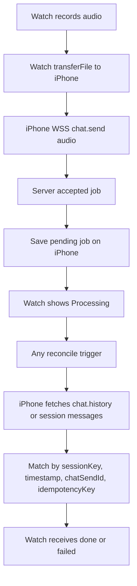

# OpenWatch — Product spec

**Version:** 0.1 (fixed)  
**Target:** iPhone companion + Apple Watch app  
**Agent:** User’s OpenClaw Gateway, default agent `main` (Coordinator) unless user picks another allowed agent after pairing.

---

## Principle

OpenWatch is a **remote voice client**. It does not replace OpenClaw. The user must connect to **their** Gateway before voice commands work.

---

## Voice UX (no hold)

Interaction is **toggle**, not press-and-hold.

| State | User action | Watch UI |
|-------|-------------|----------|
| **idle** | Tap primary control | Start listening |
| **listening** | Tap again | Stop recording → send |
| **sending** | — | Transcribing / uploading (brief) |
| **running** | — | Loader + short status (“Working…”) |
| **done** | — | Job detail screen |
| **failed** | — | Error + retry / back |

### Flow

```text
[idle] --tap--> [listening] --tap--> [sending] --> [running] --> [done|failed]
```

1. **First tap** — start microphone capture (indicator: “Listening…”).
2. **Second tap** — stop capture, finalize audio, run STT, submit job to Gateway.
3. While the agent runs — show **loader** on Watch (status may update from iPhone via `WCSession`).
4. When complete — open **Job screen** with full text response.
5. Job screen — **Read aloud** (TTS) and optional replay; back to job list / home.

### Non-goals (v1)

- Press-and-hold to record.
- Streaming partial assistant text on Watch during long runs (optional later; v1 = loader + final text).
- Sending replies to Telegram by default (Gateway ingress should use `deliver: false` for watch-origin jobs).

---

## Platform split

| Layer | Responsibility |
|-------|----------------|
| **Apple Watch** | Listen / send controls, loader, job list, job detail, TTS playback, lightweight state sync |
| **iPhone** | OpenClaw pairing, Keychain tokens, STT, Gateway HTTP/WebSocket, job store, `WatchConnectivity` relay |

Recording may start on Watch or iPhone; **v1 recommendation:** capture on **iPhone** for simpler permissions and STT, Watch sends `startListening` / `stopAndSend` commands over `WCSession`.

### Background (after pairing)

Once paired, the user should **not** need OpenWatch in the foreground on iPhone.

| Requirement | Notes |
|-------------|--------|
| **Pairing once** | Setup code + `devices approve` on iPhone only |
| **Permissions once** | Mic + Speech Recognition granted on iPhone (first launch) |
| **Watch → iPhone** | `WCSession.transferUserInfo` wakes the companion app in background |
| **iPhone audio** | `UIBackgroundModes: audio` + `beginBackgroundTask` for listen → STT → job |
| **Phone state** | Locked in pocket is OK; iPhone must be on and paired via Bluetooth (normal Watch setup) |
| **Not required** | OpenWatch visible on iPhone, phone unlocked |

Watch UI still updates via `applicationContext` / `sendMessageData` when the system delivers them; job results persist on iPhone and sync when connectivity is available.

### Pending-result reconcile architecture

OpenWatch does **not** rely on keeping the iPhone app alive until a long OpenClaw run finishes. The iPhone only needs to submit the Watch audio to the user's Gateway, verify that the server accepted the work, persist the pending job, and then reconcile the result later whenever iOS/watchOS gives the app another foreground or background opportunity.



Pending job fields:

- `watchJobId`
- `sessionKey`
- `chatSendId`
- `createdAt` / accepted timestamp
- `idempotencyKey`
- last known status / last retry timestamp

Reconcile triggers:

- Watch app open / return to main screen.
- Speak button screen appear.
- iPhone app foreground.
- `WCSession` reachability change.
- Periodic Watch foreground timer while pending jobs exist, every 5 seconds with a bounded retry count.
- Watch complication / timeline refresh, as a best-effort supplemental trigger.
- iPhone Background App Refresh, as a best-effort supplemental trigger; if iOS grants runtime and pending jobs exist, retry result fetch during the allowed window.
- Local notification tap, as a user-driven fallback.

Result authority:

- The old live WSS is **not** the source of truth after `chat.send` is accepted.
- Final results are restored from Gateway history/session messages.
- Watch result delivery uses `sendMessageData` when reachable and `transferUserInfo` as the queued fallback.

---

## Job model (local)

Each voice command creates one **Job** (persisted on iPhone, mirrored to Watch).

| Field | Type | Notes |
|-------|------|--------|
| `id` | UUID | Created on first tap |
| `status` | enum | `idle`, `listening`, `sending`, `running`, `done`, `failed`, `cancelled` |
| `transcript` | String? | STT result |
| `resultText` | String? | Final assistant text for user |
| `errorMessage` | String? | User-facing, English in UI |
| `gatewayRunId` | String? | Task / run lookup on Gateway |
| `agentId` | String | Default `main` |
| `createdAt` | Date | |
| `completedAt` | Date? | |

### Watch screens

1. **Home** — primary listen/send control + recent jobs.
2. **Listening** — visual feedback only (second tap = send).
3. **Running** — `ProgressView` + status line.
4. **Job detail** — scrollable `resultText`, **Read aloud**, **Back**.

---

## Agent behavior

- Default target: Gateway agent id **`main`** (Coordinator).
- User may select another agent id after pairing if Gateway exposes it via `agents_list` (optional v1.1).
- Commands should not duplicate Telegram traffic unless user explicitly enables it.

---

## Long-running work

- Jobs may run minutes. **Job state authority = iPhone pending-job store + Gateway history**, not a single live WSS wait.
- If Watch app suspends, user gets the result when any reconcile trigger runs and the iPhone fetches pending results.
- Optional: haptic on Watch when job transitions to `done` / `failed`.

---

## Language

- **UI strings:** English.
- **STT:** User locale (e.g. `ru-RU` for Alex); configurable in iPhone settings.
- **Agent reply language:** Follows Gateway agent / user rules (not controlled by OpenWatch v1).

---

## Security (product level)

- No Gateway master token baked into the app binary.
- Credentials only via **Native OpenClaw pairing** (setup code entry) — see [PAIRING.md](PAIRING.md).
- Remote Gateway access: **WSS** or Tailscale Serve (no public `ws://` for mobile).

---

## Related

- [PAIRING.md](PAIRING.md) — connection to Gateway  
- [OpenClaw Sub-agents](https://docs.openclaw.ai/tools/subagents) — not used for Watch jobs in v1 (direct `main` run)
